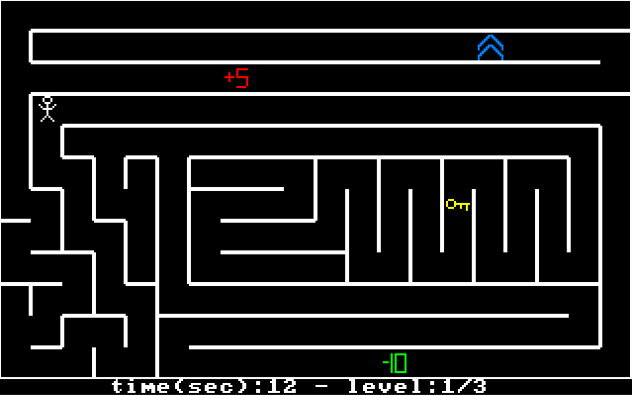
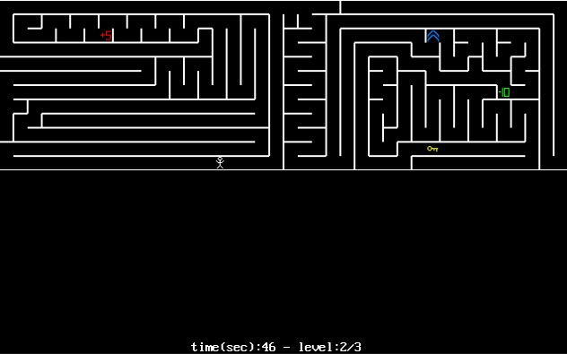
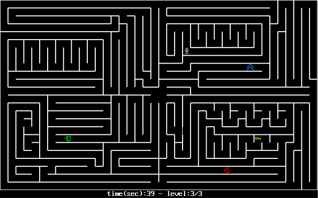

# Recursive Backtracking Assembly Game
**Random** maze solving game generated with **recursive backtracking** implemented in **Assembly** for our **final project** in Assembly course.

## Photos

## Tasks
- [x] ~~Character rendering~~ 
- [x] ~~Maze generation algorithm~~
- [x] ~~Functioning borders~~
- [x] ~~Character rendering~~
- [x] ~~Rewriting the rendering system - Omri~~
- [x] ~~Some sort of level system - Omri~~
- [x] ~~Score system - Aylon~~
- [x] ~~Timer - Both~~
- [x] ~~Code cleanup - Aylon~~
- [x] ~~Better player character - Aylon~~
- [x] ~~Better bonus icon - Aylon~~
- [x] ~~Token Generation - Omri~~
- [x] ~~Tokens design - Aylon~~
- [x] ~~Adjusting the tokens' abilities - Aylon~~
- [x] ~~Updating the pictures at the project's page - Aylon~~
- [ ] Welcome & Menu page - Aylon
- [ ] Last checkup of the code + cleanup - Aylon
